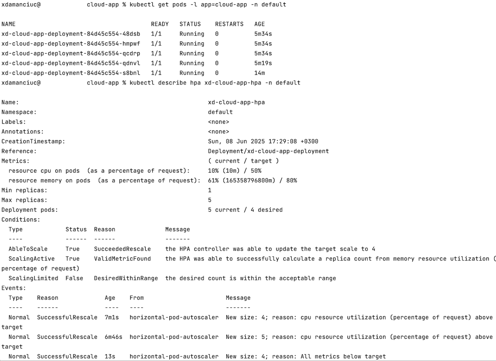
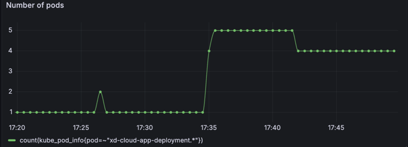

# Getting Started

### Running the Application

```
./gradlew bootRun
```

Open [http://localhost:8080](http://localhost:8080) in your browser.

### Building the Application

```
./gradlew bootJar
```

### Running the Application as a Docker Container

```
...
java -jar ./build/libs/tech-challenge-0.0.1-SNAPSHOT.jar
```

### Requirements

1. This project should be made to run as a Docker image.
2. Docker image should be published to a Docker registry.
3. Docker image should be deployed to a Kubernetes cluster.
4. Kubernetes cluster should be running on a cloud provider.
5. Kubernetes cluster should be accessible from the internet.
6. Kubernetes cluster should be able to scale the application.
7. Kubernetes cluster should be able to update the application without downtime.
8. Kubernetes cluster should be able to rollback the application to a previous version.
9. Kubernetes cluster should be able to monitor the application.
10. Kubernetes cluster should be able to autoscale the application based on the load.

### Additional
1. Application logs should be stored in a centralised logging system (Loki, Kibana, etc.)
2. Application should be able to send metrics to a monitoring system.
3. Database should be running on a separate container.
4. Storage should be mounted to the database container.


### Implementation
1. This project should be made to run as a Docker image.
```shell
docker build -t katzex/cloud-app:latest .

docker run katzex/cloud-app:latest
```
2. Docker image should be published to a Docker registry.

From local machine:
```shell
docker push katzex/cloud-app:latest
```
From GitHub Actions: build-and-push-to-docker-registry.yml 

3. Docker image should be deployed to a Kubernetes cluster.

Created deployment.yaml for deployment in Rancher Desktop. To deploy run below

```shell
kubectl apply -f deployment.yaml
```
To get a new image from Docker Registry, run below

```shell
kubectl rollout restart deployment 
 ```

4. Kubernetes cluster should be running on a cloud provider.

Deployed locally in Rancher Desktop.

5. Kubernetes cluster should be accessible from the internet.

Use ngrok

6. Kubernetes cluster should be able to scale the application.

```shell
kubectl scale deployment cloud-app --replicas=5
 ```
or we can change in deployment.yaml to number of desired replicas

```yaml
replicas: 3 
 ```
To apply changes 

```shell
kubectl rollout restart deployment 
 ```

7. Kubernetes cluster should be able to update the application without downtime.

Added in deployment.yaml
```yaml
readinessProbe: # defines a probe used to determine of the container is up & running
  httpGet: # performs a GET request
    path: /actuator/health # calls Spring Actuator's endpoint & ensures pods are up and running, before deleting the old one
    port: 8080 # application's port
  initialDelaySeconds: 5 # nr of sec to wait after the container has started before the probes are invoked
  periodSeconds: 5 # how often readiness probe should be invoked (in sec)
 ```

8. Kubernetes cluster should be able to rollback the application to a previous version.

```shell
# to check history run below
kubectl rollout history deployment/xd-cloud-app-deployment 

# to rollback to previous version
kubectl rollout undo deployment/xd-cloud-app-deployment

# to rollback to specific version
kubectl rollout undo deployment/xd-cloud-app-deployment --to-revision=1
 ```

9. Kubernetes cluster should be able to monitor the application.

Current application was configured to expose metrics with Spring Actuator and Micrometer. 

Install Helm chart and create namespace:
```shell
helm repo add prometheus-community https://prometheus-community.github.io/helm-charts
helm repo update

helm install kube-prometheus-stack prometheus-community/kube-prometheus-stack \
  -n monitoring-cloud-app --create-namespace
```

Having service.yaml configured, apply the changes:
```shell
kubectl apply -f service.yaml
 ```
Having service-monitor.yaml configured, apply the changes:
```shell
kubectl apply -f service-monitor.yaml
 ```

Ensure that Prometheus took all configs:
```shell
kubectl rollout restart statefulset prometheus-kube-prometheus-stack-prometheus -n monitoring-cloud-app
 ```
Check targets:
```shell
kubectl port-forward svc/kube-prometheus-stack-prometheus -n monitoring-cloud-app 9090:9090
 ```
Forward port to access Grafana:
```shell
kubectl port-forward svc/kube-prometheus-stack-grafana -n monitoring-cloud-app 3000:80
 ```
Reveal password for Grafana:
```shell
kubectl get secret kube-prometheus-stack-grafana -n monitoring-cloud-app -o jsonpath="{.data.admin-password}" | base64 --decode
 ```

Import cloud-app/JVM (Micrometer)-1749395667708.json to load configured dashboard.

10. Kubernetes cluster should be able to autoscale the application based on the load.

Run script to monitor the replicas in Terminal:

```shell
 while true; do                                        
  clear
  date
  kubectl get hpa xd-cloud-app-hpa -n default
  sleep 5
done 
```

Run below to start load testing:
```shell
seq 1 50 | xargs -n1 -P10 bash -c 'while true; do curl http://localhost:51723/cpu-test; done'
```
Or go to Grafana and monitor dashboard, panel - Number of pods.

Example of how it auto-scaled:


Or in Grafana dashboard:



Recording from Grafana and results of auto-scaling: /cloud-app/Screen Recording 2025-06-08 at 18.27.13.mov


